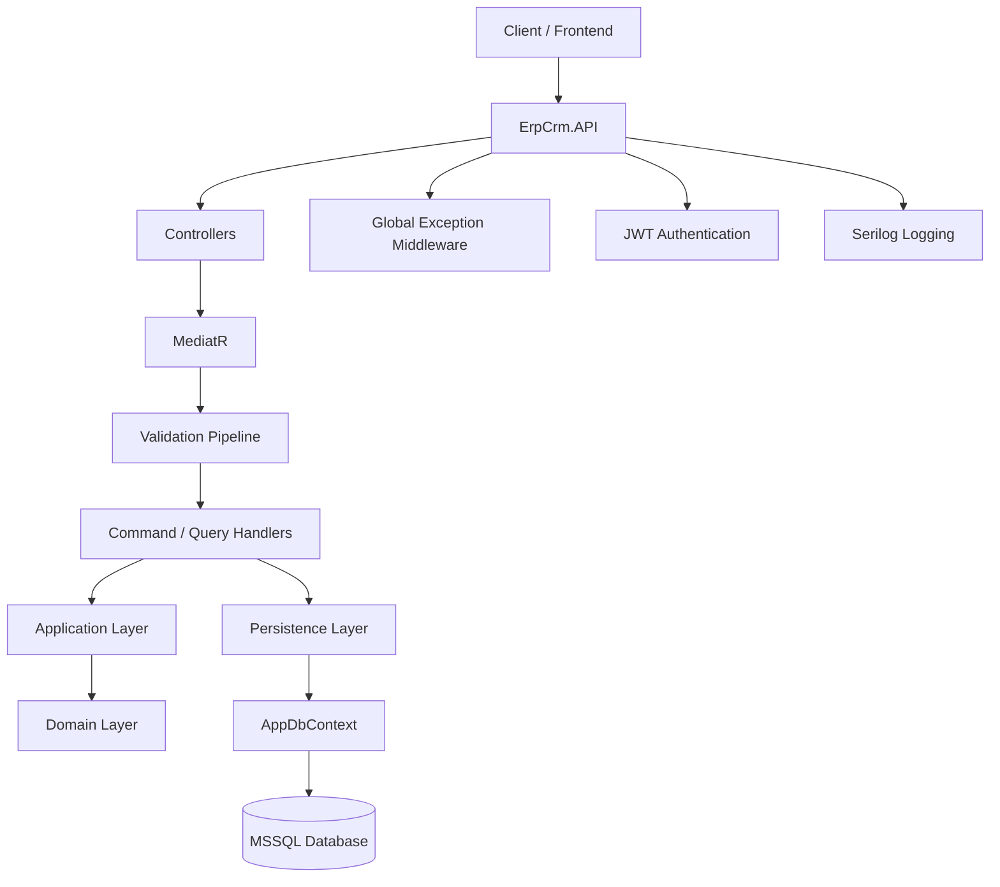
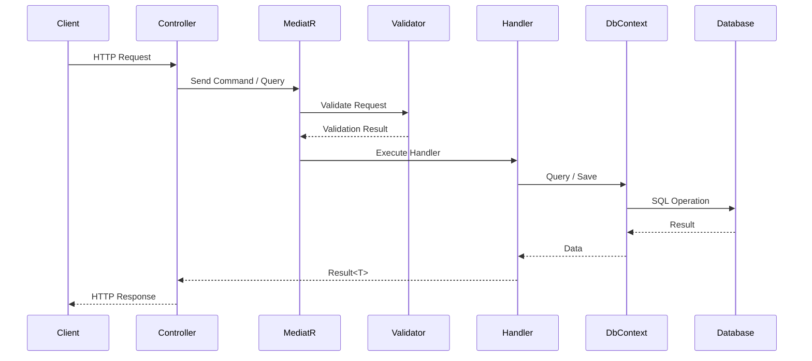
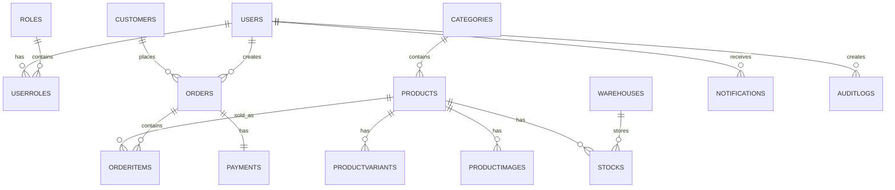

```mermaid
flowchart LR
    A[Create Order] --> B[Validate Customer]
    B --> C[Validate User]
    C --> D[Check Stock]
    D --> E[Create Order Items]
    E --> F[Decrease Stock]
    F --> G[Create Stock Movement]
    G --> H[Create Payment]
    H --> I[Create Notification]
    I --> J[Create Audit Log]
```

# ERP CRM Backend System

<p align="center">
  
  
  
  
  
</p>

<p align="center">
  <b>Production-oriented ERP / CRM backend system built with ASP.NET Core Web API, Clean Architecture, CQRS, MediatR, EF Core, MSSQL, JWT, Serilog, FluentValidation and Bogus.</b>
</p>

<p align="center">
  <a href="#-türkçe-dokümantasyon">🇹🇷 Türkçe</a> |
  <a href="#-english-documentation">🇬🇧 English</a>
</p>

---

## Project Status

> This project is currently under active development.  
> The core architecture, authentication, CQRS structure, validation pipeline, audit logging and fake data engine have been implemented.  
> Massive data generation, dashboard analytics, Redis cache, Hangfire and advanced event-driven workflows are planned.

---

# 🇹🇷 Türkçe Dokümantasyon

## Proje Hakkında

Bu proje, modern .NET teknolojileri kullanılarak geliştirilmiş **production odaklı ERP / CRM backend sistemi**dir.

Amaç; gerçek bir kurumsal backend sisteminde ihtiyaç duyulan temel yapıların uygulanmasıdır:

- Ölçeklenebilir mimari
- Temiz katman ayrımı
- CQRS tabanlı iş akışı
- JWT authentication
- Role-based authorization
- Global exception handling
- Merkezi validation pipeline
- Audit logging
- Fake data generation
- Stok, sipariş, ödeme ve bildirim simülasyonu

Bu proje yalnızca basit bir CRUD API değildir. Gerçek ERP/CRM mantığını yansıtacak şekilde modüler ve genişletilebilir olarak tasarlanmıştır.

---

## Kullanılan Teknolojiler

| Kategori | Teknoloji |
|---|---|
| Backend | ASP.NET Core Web API |
| Framework | .NET 10 |
| ORM | Entity Framework Core |
| Database | MSSQL |
| Architecture | Clean Architecture |
| Pattern | CQRS |
| Mediator | MediatR |
| Authentication | JWT + Refresh Token |
| Authorization | Role-based Authorization |
| Validation | FluentValidation |
| Logging | Serilog |
| Fake Data | Bogus |
| Documentation | Swagger / OpenAPI |

---

## Mimari Yapı

```txt
ErpCrm.Backend
├── ErpCrm.API
├── ErpCrm.Application
├── ErpCrm.Domain
├── ErpCrm.Infrastructure
└── ErpCrm.Persistence
```

### Katmanların Görevleri

| Katman | Sorumluluk |
|---|---|
| API | Controller, middleware, Swagger, JWT config, HTTP pipeline |
| Application | CQRS, DTO, Validator, Handler, Interface, Result Pattern |
| Domain | Entity, enum, base model |
| Infrastructure | JWT service, password hashing, current user, fake data |
| Persistence | DbContext, Fluent API, migrations, database seed |

---

## Mimari Diyagram



---

## Modüller

Sistemde aşağıdaki temel ERP / CRM modülleri bulunmaktadır:

| Modül | Açıklama |
|---|---|
| Users | Sistem kullanıcıları |
| Roles | Admin, Manager, Employee rolleri |
| Customers | Müşteri yönetimi |
| Categories | Ürün kategorileri |
| Products | Ürün yönetimi |
| Product Variants | Renk, beden, varyant yönetimi |
| Product Images | Ürün görsel yönetimi |
| Warehouses | Depo yönetimi |
| Stocks | Stok kayıtları |
| Stock Movements | Stok giriş/çıkış geçmişi |
| Orders | Sipariş yönetimi |
| Order Items | Sipariş kalemleri |
| Payments | Ödeme kayıtları |
| Notifications | Sistem bildirimleri |
| Audit Logs | İşlem geçmişi |

---

## Authentication & Authorization

Sistemde JWT tabanlı authentication yapısı kurulmuştur.

### Özellikler

- Register
- Login
- Access Token
- Refresh Token
- Logout
- Password hashing
- Role-based authorization
- CurrentUserService

### Roller

```txt
Admin
Manager
Employee
```

### Authorization Örneği

```csharp
[Authorize(Roles = "Admin")]
[HttpDelete("{id:int}")]
public async Task<IActionResult> Delete(int id)
{
    var result = await _mediator.Send(new DeleteUserCommand(id));
    return StatusCode(result.StatusCode, result);
}
```

---

## CQRS + MediatR Yapısı

Her modül feature-based folder structure ile yönetilir.

```txt
Features
└── Products
    ├── Commands
    │   ├── CreateProduct
    │   ├── UpdateProduct
    │   └── DeleteProduct
    ├── Queries
    │   ├── GetProducts
    │   └── GetProductById
    ├── DTOs
    └── Validators
```

### CQRS Akışı



---

## Validation Pipeline

FluentValidation, MediatR pipeline içerisine entegre edilmiştir.

Bu sayede validation işlemleri:

- Controller içine yazılmaz
- Handler içinde tekrar edilmez
- Merkezi olarak yönetilir
- Tüm command’lara otomatik uygulanır

```txt
Request
→ ValidationBehavior
→ Validator
→ Handler
→ Result
→ Controller
```

---

## Global Exception Middleware

Sistemde merkezi exception middleware bulunmaktadır.

Standart hata response formatı:

```json
{
  "success": false,
  "message": "Validation error",
  "errors": [
    "Email is required"
  ],
  "statusCode": 400,
  "traceId": "..."
}
```

---

## Result Pattern

Tüm handler response’ları standart `Result<T>` modeli üzerinden döner.

Bu sayede controller kodları sade kalır:

```csharp
var result = await _mediator.Send(command);
return StatusCode(result.StatusCode, result);
```

---

## Database Tasarımı

Veritabanı olarak MSSQL kullanılır.

### Özellikler

- EF Core
- Fluent API
- Proper foreign key ilişkileri
- Index optimizasyonları
- Soft delete
- UTC date kullanımı

Tüm temel entity’lerde aşağıdaki alanlar bulunur:

```txt
CreatedDate
UpdatedDate
DeletedDate
IsDeleted
```

---

## Entity Relationship Overview



---

## Audit Logging

Audit sistemi önemli işlemleri takip eder.

Loglanan işlemler:

- Create
- Update
- Delete
- Login
- Stock changes

AuditLog alanları:

```txt
UserId
Action
EntityName
OldValues
NewValues
IPAddress
CreatedDate
```

---

## Fake Data Engine

Bogus kullanılarak gerçekçi demo verileri oluşturulur.

### Mevcut Fake Data Yapısı

- Users
- Customers
- Categories
- Products
- Product Variants
- Product Images
- Warehouses
- Stocks
- Orders
- Payments
- Notifications
- Stock Movements

### Simülasyon Kuralları

- Bazı müşteriler aktif, bazıları pasif oluşturulur.
- Bazı ürünler popüler olarak işaretlenir.
- Hafta sonu sipariş yoğunluğu artırılır.
- Gece saatlerinde daha az sipariş oluşturulur.
- Sipariş oluşunca stok düşer.
- Sipariş oluşunca payment oluşturulur.
- Sipariş oluşunca notification oluşturulur.

---

## Order Flow



---

## Swagger

Swagger JWT authorization desteği ile yapılandırılmıştır.

Token aldıktan sonra Swagger üzerinden:

```txt
Bearer {accessToken}
```

formatı ile protected endpoint’ler test edilebilir.

---

## Performans Yaklaşımı

Projede aşağıdaki performans pratikleri uygulanmıştır:

- AsNoTracking
- Projection
- DTO mapping
- Pagination
- Filtering
- Sorting
- Searching
- N+1 problemini önleme
- Gereksiz abstraction’dan kaçınma

---

## Çalıştırma

### Migration

```bash
dotnet ef database update --project ErpCrm.Persistence --startup-project ErpCrm.API
```

### API Çalıştırma

```bash
dotnet run --project ErpCrm.API
```

---

## Varsayılan Admin Kullanıcı

```txt
Email: admin@erpcrm.com
Password: Admin123*
```

---

## Fake Data Seed

```http
POST /api/fakedata/seed
```

Admin yetkisi gerektirir.

---

## Mevcut Durum

### Tamamlananlar

- Clean Architecture
- CQRS
- MediatR
- JWT Authentication
- Refresh Token
- CurrentUserService
- Role-based Authorization
- Result Pattern
- Global Exception Middleware
- FluentValidation Pipeline
- Serilog
- AuditLog
- Bogus Fake Data Seeder
- Product Variant & Image sistemi
- Order / Payment / Stock flow
- Swagger JWT integration

### Planlananlar

- Massive seed: 10k users / 5k customers / 5k products / 100k orders
- Domain Events
- Event-driven workflow
- Redis Cache
- Hangfire Background Jobs
- Dashboard Analytics
- Health Checks
- Docker
- Unit & Integration Tests
- API Versioning

---

# 🇬🇧 English Documentation

## Project Overview

This project is a **production-oriented ERP / CRM backend system** built with modern .NET technologies.

The goal is to implement core structures required in a real enterprise backend system:

- Scalable architecture
- Clean layer separation
- CQRS-based workflow
- JWT authentication
- Role-based authorization
- Global exception handling
- Centralized validation pipeline
- Audit logging
- Fake data generation
- Stock, order, payment and notification simulation

This is not just a simple CRUD API. It is designed to reflect real ERP/CRM logic with a modular and extensible architecture.

---

## Technologies

| Category | Technology |
|---|---|
| Backend | ASP.NET Core Web API |
| Framework | .NET 10 |
| ORM | Entity Framework Core |
| Database | MSSQL |
| Architecture | Clean Architecture |
| Pattern | CQRS |
| Mediator | MediatR |
| Authentication | JWT + Refresh Token |
| Authorization | Role-based Authorization |
| Validation | FluentValidation |
| Logging | Serilog |
| Fake Data | Bogus |
| Documentation | Swagger / OpenAPI |

---

## Architecture

```txt
ErpCrm.Backend
├── ErpCrm.API
├── ErpCrm.Application
├── ErpCrm.Domain
├── ErpCrm.Infrastructure
└── ErpCrm.Persistence
```

### Layer Responsibilities

| Layer | Responsibility |
|---|---|
| API | Controllers, middlewares, Swagger, JWT config, HTTP pipeline |
| Application | CQRS, DTOs, Validators, Handlers, Interfaces, Result Pattern |
| Domain | Entities, enums, base models |
| Infrastructure | JWT service, password hashing, current user, fake data |
| Persistence | DbContext, Fluent API, migrations, database seed |

---

## Architecture Diagram


---

## Modules

| Module | Description |
|---|---|
| Users | System users |
| Roles | Admin, Manager, Employee roles |
| Customers | Customer management |
| Categories | Product categories |
| Products | Product management |
| Product Variants | Color, size and variant management |
| Product Images | Product image management |
| Warehouses | Warehouse management |
| Stocks | Stock records |
| Stock Movements | Stock in/out history |
| Orders | Order management |
| Order Items | Order lines |
| Payments | Payment records |
| Notifications | System notifications |
| Audit Logs | Operation history |

---

## Authentication & Authorization

The system uses JWT-based authentication.

### Features

- Register
- Login
- Access Token
- Refresh Token
- Logout
- Password hashing
- Role-based authorization
- CurrentUserService

### Roles

```txt
Admin
Manager
Employee
```

---

## CQRS + MediatR

Each module is managed with a feature-based folder structure.

```txt
Features
└── Products
    ├── Commands
    │   ├── CreateProduct
    │   ├── UpdateProduct
    │   └── DeleteProduct
    ├── Queries
    │   ├── GetProducts
    │   └── GetProductById
    ├── DTOs
    └── Validators
```

---

## Validation Pipeline

FluentValidation is integrated into the MediatR pipeline.

Validation logic is:

- Not written inside controllers
- Not repeated inside handlers
- Centrally managed
- Automatically applied to commands

---

## Global Exception Middleware

Standard error response:

```json
{
  "success": false,
  "message": "Validation error",
  "errors": [
    "Email is required"
  ],
  "statusCode": 400,
  "traceId": "..."
}
```

---

## Database

MSSQL is used as the database.

### Features

- EF Core
- Fluent API
- Proper foreign key relationships
- Index optimization
- Soft delete
- UTC date usage

All base entities include:

```txt
CreatedDate
UpdatedDate
DeletedDate
IsDeleted
```

---

## Fake Data Engine

Bogus is used to generate realistic demo data.

### Simulation Rules

- Some customers are active and some are passive.
- Some products are marked as popular.
- Weekend order density is increased.
- Fewer orders are generated at night.
- Stock decreases when an order is created.
- Payment is created automatically.
- Notification is created automatically.

---

## Order Flow


---

## Running the Project

### Migration

```bash
dotnet ef database update --project ErpCrm.Persistence --startup-project ErpCrm.API
```

### Run API

```bash
dotnet run --project ErpCrm.API
```

---

## Default Admin User

```txt
Email: admin@erpcrm.com
Password: Admin123*
```

---

## Fake Data Seed

```http
POST /api/fakedata/seed
```

Admin authorization is required.

---

## Current Status

### Completed

- Clean Architecture
- CQRS
- MediatR
- JWT Authentication
- Refresh Token
- CurrentUserService
- Role-based Authorization
- Result Pattern
- Global Exception Middleware
- FluentValidation Pipeline
- Serilog
- AuditLog
- Bogus Fake Data Seeder
- Product Variant & Image system
- Order / Payment / Stock flow
- Swagger JWT integration

### Planned

- Massive seed: 10k users / 5k customers / 5k products / 100k orders
- Domain Events
- Event-driven workflow
- Redis Cache
- Hangfire Background Jobs
- Dashboard Analytics
- Health Checks
- Docker
- Unit & Integration Tests
- API Versioning

---

# License

This project is developed for educational and portfolio purposes.
